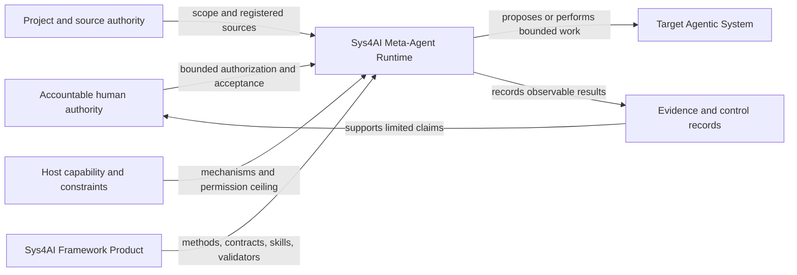
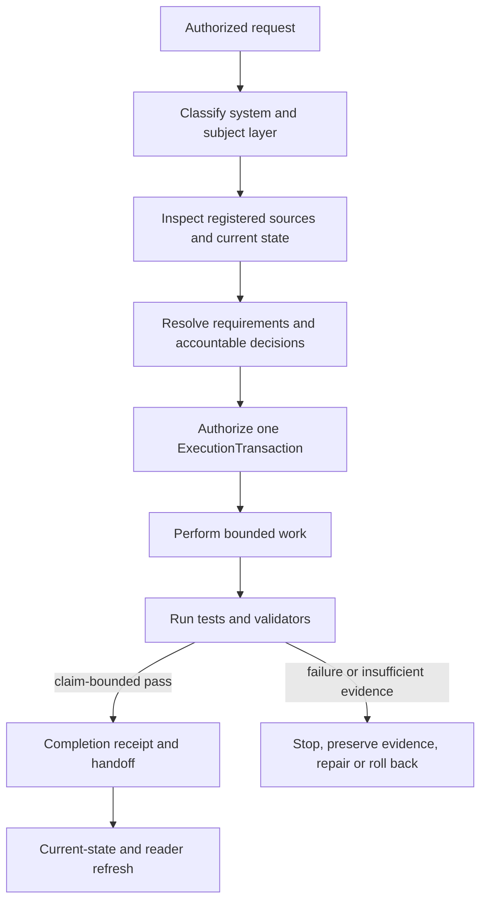

# Sys4AI Architecture

**Status:** Controlled architecture overview
**Last reviewed:** 2026-07-15
**Authority:** This document explains registered requirements, policies,
contracts, registries, and control records. It does not supersede them.

## Purpose

Sys4AI is a systems-engineering framework for defining, building, evaluating,
operating, maintaining, improving, and retiring AI agents and agentic systems
under explicit authority. Its architecture prevents output, capability, or a
passing structural check from being misrepresented as permission, execution,
acceptance, or operational proof.

## Four objects

### Sys4AI Framework Product

The governed requirements, methods, lifecycle and role models, skills,
artifact contracts, schemas, templates, registries, validators, policies,
reference implementation, and reader definitions.

### Sys4AI Meta-Agent Runtime

The executable AI-agent identity that applies the framework. It may analyze,
propose, generate, validate, or execute only within the effective authority of
the current task. It is not a source of product purpose, stakeholder approval,
host permission, or production authority.

### Host harness

The platform that provides interaction, files, terminal execution, tools,
connectors, task state, retrieval, and optional delegation. A host profile is
a time- and environment-bounded observation. It does not authorize a future
transaction.

### Target AI agent or target agentic system

A separate system of interest with its own mission, stakeholders, affected
parties, data, requirements, architecture, risk, authority, evidence,
approval, operation, and retirement state.



## Subject layer and runtime actor

Two independent axes identify controlled work:

- `subject_layer` says what is being changed: `development_system`,
  `framework_product`, `target_system_template`, `target_system_instance`, or
  `derivative_surface`.
- `runtime_actor` says who or what acts: a human principal, host harness,
  Meta-Agent Runtime, delegated role actor, target runtime, verifier, or
  operator.

The actor does not gain authority over a layer by acting on it. Classification
routes controls; it does not grant permission.

## Six repository planes

| Plane | Primary surfaces | Question answered |
|---|---|---|
| Normative | Canonical PRDs, accepted decisions, controlled policies | What must the system be, and who may decide? |
| Contract | Schemas, registries, role and artifact contracts | What structures and relationships are admissible? |
| Execution | ExecutionTransactions, permission envelopes, state, cancellation, rollback | What bounded action is authorized now? |
| Evidence | Tests, validators, receipts, reviews, evaluations, handoffs | What was observed, and which claim does it support? |
| Memory | Source and relationship registries, lookup, preflight receipts | Where is likely authority, and was it inspected? |
| Reader | Generated catalogs, summaries, role pages, flow reports | How can a human navigate the controlled graph? |

Implementation code and active skills realize these planes but do not replace
their authority sources.

## Source-authority order

When artifacts conflict, resolve the exact claim through this order:

1. explicit accountable human authority and accepted decisions for the scope;
2. canonical Product Requirements Documents;
3. controlled registries, contracts, policies, configurations, and activated
   control records;
4. controlled implementation plans and review evidence;
5. historical or derivative-draft sources;
6. generated readers, local support files, retrieval results, and chat context.

The source registry and accepted supersession records determine the precise
classification. A higher-level summary cannot silently promote itself.

## Permission intersection

An action is admissible only when it lies within every applicable boundary:

```text
effective permission =
    platform constraints
  intersect host permissions
  intersect project authorization
  intersect role authority
  intersect transaction permission envelope
```

The expression is explanatory. Current controlled permission contracts and
the host profile remain the implementation authority. Goals, values, urgency,
or capability cannot override the intersection.

## Bounded execution flow



An `ExecutionTransaction` binds the objective, requirements and decisions,
subject layer, actor, approval principal, permission envelope, reads, writes,
tools, forbidden actions, validators, stop conditions, host evidence, state,
cancellation, escalation, closeout, rollback, and supersession. A valid
transaction structure is not authorization unless its authorization and
permission evidence are current.

## Evidence and acceptance

Evidence supports a bounded proposition. Acceptance is an accountable
decision about whether that evidence is sufficient for a stated scope.

- a parser or schema pass supports a structural claim;
- a path and graph pass supports referential consistency;
- a test supports behavior under its recorded conditions;
- a verification result supports a named requirement claim;
- a validation or evaluation supports only its stated intended-use or rubric
  scope;
- stakeholder, domain, release, production, and operational acceptance remain
  separate decisions.

No model-generated receipt performs human acceptance, and no evidence family
silently substitutes for another.

## Skill surfaces

| Surface | Role | Boundary |
|---|---|---|
| `.agents/skills/` | Active development-runtime skills | Current repository runtime behavior |
| `.codex/skills/` | Compatibility shims | Pointers only; no independent behavior |
| `Sys4AI/skills/core/` | Portable framework-product scaffolds | Product reference, not active runtime authority |

Moving content between these surfaces requires explicit adaptation,
provenance, registry, and validation work.

## Current non-production boundary

The current state is an accepted bounded baseline at lifecycle stage `test`.
The repository validates a framework scaffold, evidence controls, and a
non-production target-package flow. It does not establish a production target
runtime, independent external evaluation, stakeholder or affected-party
acceptance, target-domain acceptance, production readiness, operational
authority, or permission expansion.

See [program_state.yaml](Sys4AI/control_records/program_state.yaml) and the
[Codex reference-host profile](Sys4AI/configs/host_profiles/codex_app_reference.toml)
for live state and freshness limits.

## Self-hosting without self-authorization

Sys4AI-dev may use Sys4AI methods to improve Sys4AI, but the development
workspace, framework product, runtime actor, host, target, and generated
surfaces remain distinct. Self-reference does not permit the runtime to approve
its own purpose, values, permissions, evaluation standard, release status, or
authority. Accepted history is preserved and changed through additive
supersession rather than retroactive rewriting.
